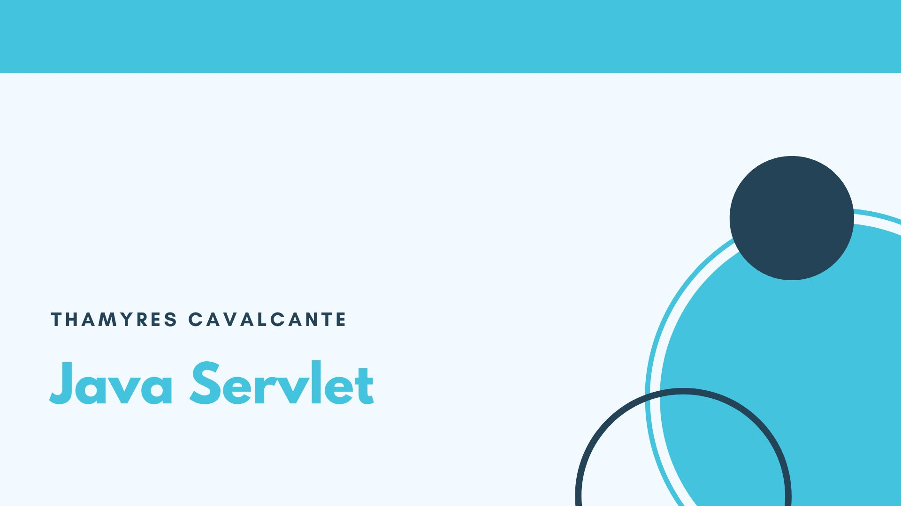

| :placard: Vitrine.Dev |     |
| -------------  | --- |
| :sparkles: Nome        | **Java Servlet**
| :label: Tecnologias | Java, Servlet, Html, Css
| :rocket: URL         | https://github.com/Thamyresmya/Projeto_Servlet
| :fire: Desafio     | 

# Projeto Servlet: Programação web Java

Projeto desenvolvido em Java através do curso da Alura - Java Servlets.

  <a href="#-Tecnologias">Tecnologias</a>&nbsp;&nbsp;&nbsp;|&nbsp;&nbsp;&nbsp;  
  <a href="#-Projeto">Projeto</a>&nbsp;&nbsp;&nbsp;|&nbsp;&nbsp;&nbsp;  
  <a href="#-Gif">Gif</a>&nbsp;&nbsp;&nbsp;|&nbsp;&nbsp;&nbsp; 
  <a href="#-Imagens">Imagens</a>&nbsp;&nbsp;&nbsp;&nbsp;&nbsp;&nbsp;

 

## 🚀 Tecnologias

Esse projeto foi desenvolvido com as seguintes tecnologias:

- Java
- Servlet
- Tomcat
- Eclipse
- Git e Github

 

## 💻 Projeto

Projeto desenvolvido junto com o curso da Alura, primeiro projeto com Sevlet, foram desenvolvidos mapeamentos de requisições HTTP, trabalhando com POST e GET, gerando paginas HTML dinamicamente com JSP e JSTL, redirecionando o fluxo e criação de CRUD completo. 

 

## 📸 Gif
Processo dinâmico.

</img>

 

## 📸 Imagens
Página Login.

</img>

Página bem-vindo.

</img>

Página Cadastro de Empresa.

</img>

Página Lista Empresas.

</img>

Página Altera Empresa.

</img>

 

- Me siga nas redes sociais:
- [Linkedin](https://www.linkedin.com/in/thamyrescavalcante/)
- [Instagran](https://www.instagram.com/thamyres__cavalcante/)

 

---

Feito com ♥ by Thamyres Cavalcante.
